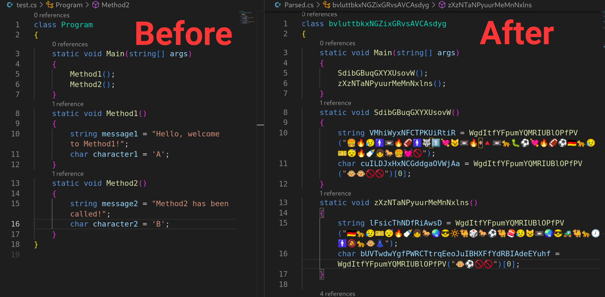

## Emojify
    🔋⌚🐆💀                                     
    ⌛       🌵     🌵      🌈 🍡        🥚 👖  👢🎹🎹 🍬   🌽 
    🔋       🍟🔨 🔑🍟    🚀    🍭       🗼 🎍  💄       🍬🌽  
    ⌛🌷💀   🌵  🚬 🌵    ⚽    🎱       🥚 👖  👢🎹🎹    🚩   
    🔋       🍟     🍟    🎱    ⚽       🗼 🎍  💄        🎌   
    ⌛       🌵     🌵    🍭    🔪 👝    🥚 👖  👢        🏁   
    🔋⌚🐆💀 🍟     🍟      🔪🏈   🎽💼🗼   🎍  💄        🚩   
Obfuscates charcater and string literals into emojis and randomises classes, interfaces, methods and variable names.

### NB
- Inherited, overriden and implemented (interface methods) methods are skipped during obfuscation.

### Usage
```bash
git clone https://github.com/Tomiwa-Ot/Emojify.git
cd Emojify/
dotnet publish -c Release
cp bin/Release/net8.0/<arch_type>/publish/Emojify .
Emojify -i <PATH_TO_CODE> -o <OUTPUT_PATH>
```



### Demo
[](https://odysee.com/@tomiwa:4/Emojify-_-C--Obfuscator:6)
